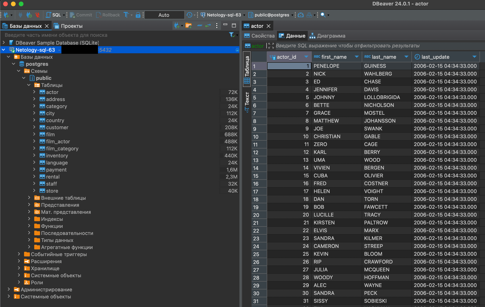

######################################################################################
### SQL-61   _Евгений Васильев_
######################################################################################

## Модуль 1. Домашнее задание по теме «Введение в SQL и установка ПО»

Задание 1.)

Задание 2.) 

[ER-диаграмма таблиц, скрин](./img/SQL-Task1-img2.png)

Задание 3.)
